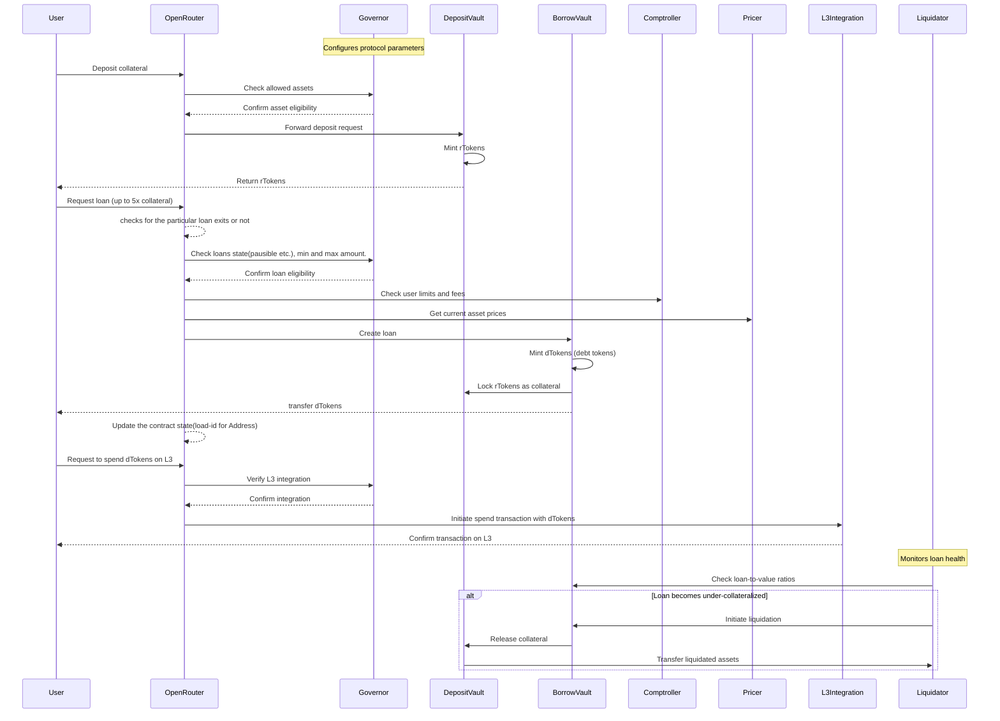

# Hashstack V1 Contracts

This repository contains all code related to Hashstack V1 contracts. The repo is divided into four main sub-modules:

1. **common** - Contains interfaces, structs, common components, and contracts like AccessControl.cairo. This module serves as a library for all other modules.
2. **core** - Contains the core logic of the protocol and its contracts.
3. **Peripheral** - Contains non-essential secondary contracts like Staking.
4. **integrations** - Contains logic for 3rd party integrations to provide spend functionality of loans.

## Table of Contents

- [Project Structure](#project-structure)
- [High-level Contracts Flow](#high-level-contracts-flow)
- [Standards for Maintaining and Writing a Contract](#standards-for-maintaining-and-writing-a-contract)
- [Contracts Overview](#contracts-overview)
- [Core Contracts](#core-contracts)
- [Integration of New Dapp at L3](#integration-of-new-dapp-at-l3)

## Project Structure

[See Project Structure](#project-structure)

## High-level Contracts Flow

## Standards for Maintaining and Writing a Contract

Each contract embeds a component called `common/components/security.cairo` (except for access control). This component contains all essential logic required to maintain the security of your contract. It takes an access control address to initialize it. The component comes with support for:

a. Access control read

b. Re-entrancy attack prevention

c. Pausable functionality

d. Upgradeability

You can embed `SecurityImpl` from this component in your contract. It contains internal functions like `assert_role`, `_renack_start`, `initializer`, and `assert_not_paused` that you can use in your contract as you see fit.

## Contracts Overview

### Core Contracts

. [**Governor**](#governor): Central configuration and management hub for the protocol.
. [**Comptroller**](#comptroller): Manages protocol parameters, fees, and thresholds.
. [**Liquidation**](#liquidation): Handles loan liquidations and self-liquidations.
. [**Pricer**](#pricer): Fetches and provides market prices of assets from designated oracles.
. [**Dial**](#dial): Manages and computes dynamic interest rates for different markets.
. [**Collector**](#collector): Manages liquidation shares and fee collection within the protocol.
. [**Supply (Deposit Vault Core)**](#supply): Manages deposits and rToken minting.
. [**Borrow**](#borrow): Handles all borrowing-related operations and collateral management.
. [**OpenRouter**](#router): Acts as a central routing hub for various protocol components.

### Governor 

The Governor contract serves as a central configuration and management hub for the protocol. It handles the setup and maintenance of deposit vaults, borrow vaults, asset metadata, and various protocol parameters. The contract also manages integrations with external services, controls access to different functions through role-based permissions, and provides view functions to retrieve critical protocol information.

### Comptroller 

Comptroller: The Comptroller contract serves as the central parameter management system for the protocol. It handles setting and retrieving various protocol fees, factors, and thresholds that govern the protocol's operations. The contract also includes role-based access control for administrative functions and provides view functions to access critical protocol parameters.

### Liquidation 

The Liquidation contract manages risk through standard, self, and smart liquidations. It handles collateral and loan repayments during liquidation events, validating conditions and processing liquidations efficiently. The contract prioritizes protocol stability by swiftly resolving under-collateralized positions while maintaining fairness for all parties involved.

### Pricer 

Pricer: The Pricer module serves as the protocol's oracle interface, providing up-to-date asset prices. It supports flexible pair ID settings for easy asset integration and offers asset values in various denominations. The module implements TWAP mechanisms to mitigate short-term price volatility, enhancing overall protocol stability and security.

### Dial 

The Dynamic Interest Module (Dial) manages interest rate mechanics on the Starknet Blockchain. It computes and adjusts rates dynamically across markets, calculating borrowing and staking APRs based on real-time market conditions. The module constantly updates interest rate states to ensure the protocol remains competitive and balanced.

### Collector 

Collector: The Collector contract manages liquidation shares and orchestrates fee collection processes. It facilitates liquidation loss coverage requests and implements a rebate system to incentivize positive user behaviors. By managing liquidation shares and fee distribution, it acts as a crucial financial backstop, reinforcing the protocol's stability.

### Supply 

The Deposit Vault Core contract manages user deposits, issuing rTokens as stake representation. It enables locking and freeing of rTokens for various protocol activities and facilitates asset transfers between deposit and borrow vaults. The contract handles ERC20 token operations and provides transparent access to critical deposit and withdrawal information.

### Borrow 

The Borrow contract handles all borrowing-related operations within the protocol, including loan creation, repayment, and collateral management. It ensures that loans are adequately collateralized by tracking and managing collateral deposits, calculating loan-to-value ratios, and triggering liquidations if collateral falls below required thresholds. The contract also interacts with third-party decentralized applications, updates debt token prices, and performs loan health checks to maintain the integrity and security of the lending and borrowing processes. 

### Router 

The Router contract acts as a central routing hub, managing interactions between various components such as borrowing, lending, and staking within the protocol. It handles the deposit and withdrawal of assets, loan requests, and collateral management, directing these operations to the appropriate subcontracts. 

## User Flow: Deposit, Borrow, and Spend on L3

This section provides a detailed explanation of how a user interacts with the Hashstack protocol to deposit collateral, obtain a loan, and spend the borrowed funds on an L3 network.

### Flow Diagram

## Integration of New Dapp at L3

[Details about integrating new Dapps at L3 to be added here]
